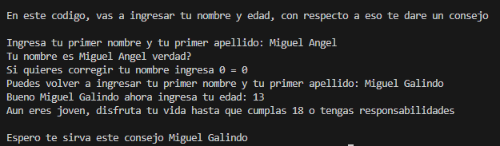
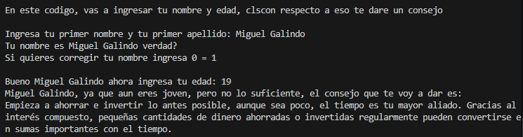
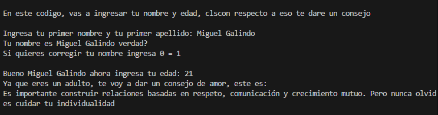

# Algoritmo encuesta edad/consejo
## Miguel Angel Galindo Rubio
### Voy a poner a prueba cada posibilidad en la encuesta:
### Como primer instante, probar que pasa con uno que no cumpla la funcion del codigo, adicional, aproveche para mostrar el funcionamiento que puse para volver a poner el nombre en caso de que se hayan equivocado

### Ahora vamos a poner una edad mayor a 18 y menor a 20

### Y por ultimo una edad mayor a 20 años

### Asi es el funcionamiento de todo el codigo.